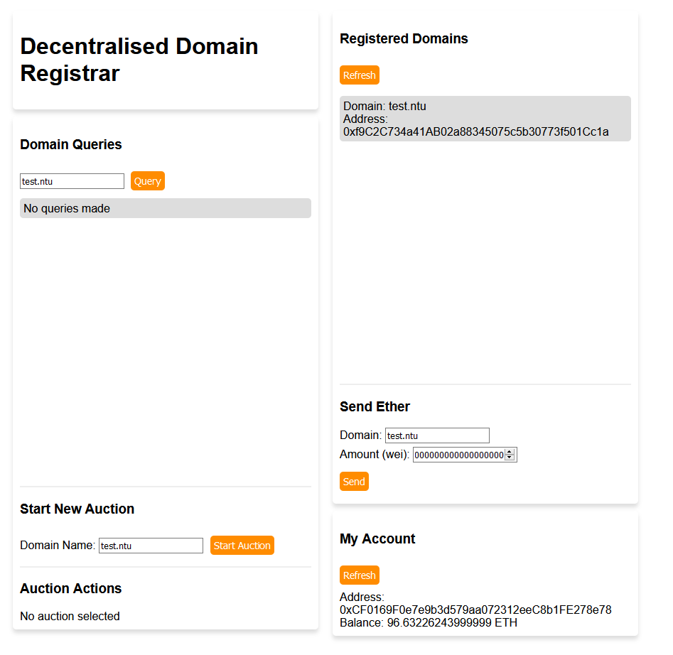

# Decentralised Domain Registrar

## Summary
This project fulfills the requirements for NTU's CZ4153 Blockchain Technology.

The aim is to build a “xxx.ntu” domain name registrar service on Ethereum testnet, using “commit-and-reveal” bidding process and a simple (minimally styled) front end website to interact with the blockchain. Supports listing of registered domains, query the actual address behind a domain and bid for an unregistered domain etc.



## Contracts
Contracts are located in the [contracts](contracts) folder.
- [BlindAuction.sol](contracts/BlindAuction.sol)
    - Deployed by DomainRegistry on ```startAuction()``` call
    - Handles all blind auction logic
- [DomainRegistry.sol](contracts/DomainRegistry.sol)
    - Handles deployment of auctions and emission of events
- [Migrations.sol](contracts/Migrations.sol)
    - Used by Truffle for initial deployment of contracts

## Application Architecture


### Overall Architecture
`DomainRegistry` is the centrepiece of the application. Users call `DomainRegistry` to start auctions for unregistered and unclaimed domain names. `DomainRegistry` then deploys a `BlindAuction` for that domain name. 

Users then interact directly with the `BlindAuction` contract instance for all auction activities e.g. bidding, revealing, claiming.

The only time when `BlindAuction` interacts with `DomainRegistry` is when the auction winner (determined by the highest bidder at the end of the Reveal Stage) wants to claim the domain. `DomainRegistry` will save the registration details (i.e. domainName -> ownerAddress) in `records`.

Subsequently, when a user wants to send a transaction to a registered domain name he can query the `DomainRegistry` (in this case, through the website) to resolve the domain name to the corresponding ownerAddress.

The 3 detailed scenario diagrams can be found through the respective links:
- [During Auctions](assets/images/during_auctions.png)
- [Claiming a Domain](assets/images/claiming_a_domain.png)
- [Sending Ether Through Domain](assets/images/sending_ether_through_domain.png)

## Auction Implementation
A Blind Auction is implemented. There are 3 stages: Bid, Reveal, Claim.

### Bid
Users can bid however many times they want in this duration.
Each bid consists of:
- `Value`: the value of the bid
- `Fake flag`: whether the bid is fake or not
- `Secret`: a secret to add an additional layer of security
- `Deposit` (value of the transaction): for a bid to be valid, deposit must be >= value

The (value, fake, secret) information is hashed using solidity's Keccak256 hash function and named `blindedBid`. The bid sent to BlindAuction only consists of the `blindedBid` and the deposit, which is the value of the transaction.

This way, there is no way to know before the reveal stage the information of the bids. Even if one checks the transaction values for the bids, there is no way to know if the bids are valid and/or fake. This essentially makes the auction "blind".

### Reveal
In this stage, bidders can send plaintext versions of their bidding information to `BlindAuction` as proof that they were the bidders. `BlindAuction` internally checks whether the hashed version of the plaintext information matches the prior `blindBid` sent. If a bid is valid (i.e. `deposit` >= `value`) and fake (i.e. fake flag is set as `false`) and is the current highest bid revealed, then it is stored as the `currentHighestBid`. All other bids (including fake and invalid ones) have their deposits refunded to the respective bidder.

Whenever the `currentHighestBid` is increased, the previous `currentHighestBidder` will be refunded the previous `currentHighestBid` amount automatically.

At the end of the reveal stage, the `currentHighestBid` and corresponding `currentHighestBidder` will win the auction. Even if there are higher bids that are unrevealed, they do not win. Unrevealed bids after the reveal stage can also not be refunded, and are basically voided forever.

### Claim
In this stage, only the `highestBidder` can claim the domain name. `BlindAuction` will send the `bidderAddress` to the `DomainRegistry` to permanently register the domain name under the `bidderAddress`. This information can be subsequently used to resolve the domain name to the ownerAddress.

## Frontend
Simple web interface bundled by webpack.
- [src](frontend/src): web page source files
- [dist](frontend/dist): build files produced by webpack - for production

## Development Prerequisites
The following should be installed prior to development
 - [NodeJS](https://nodejs.org/en/): Runtime environment for JS applications
 - [Truffle Ganache](https://www.trufflesuite.com/ganache): For blockchain visualisation and local deployment
 - [Truffle](https://www.trufflesuite.com/truffle): For contract compilation, testing and migration
 - [Metamask Browser Extension](https://chrome.google.com/webstore/detail/metamask/nkbihfbeogaeaoehlefnkodbefgpgknn?hl=en): For interaction with the blockchain

## Development and Building
### Setup
To begin development, simply set up a local blockchain with Ganache and run
a development server with webpack.
1. Open Ganache and use the included [truffle.config.js](truffle-config.js) file to set up your workspace.
2. Deploy local development blockchain:
   ```
   npm install         //install truffle packages
   truffle migrate     //compile contracts and 'migrate' contracts to blockchain
   ```
    The DomainRegistry contract should now be deployed on Ganache.
3. Set up frontend:
   ```
   cd frontend
   npm install          //install webpack + web3 dependencies
   npm run build        //build frontend
   npm run dev          //run development server for UI
   ```
   You should now be able to access the application at ```localhost:8080```
4. Connect Metamask to Ganache and Web page
   1. Login to Metamask via the Metamask extension
   2. In Metamask, connect to network as given by RPC server address of Ganache
   3. In Ganache, *Accounts* > choose any account > *key icon* > copy private key
   4. In Metamask, *account icon* > *Import Account* > paste in your private key
   5. In Metamask, connect account to site
5. The app is now ready for use in a development setting.

### Redeployment
When trying to redeploy contracts,
```
//in root directory
truffle migrate --reset     //forces re-migration of contracts and clears currenty deployed contracts from the network

//in frontend directory
npm run dev              //rebuilds frontend (to fix nonce out of sync issue)
```

## Testing
Run `truffle test` in the root directory to run included tests. Tests are found in the [test folder](test).

### Test explanation

All unit tests were conducted in `DomainRegistry.js`.
For testcases involving an Auction (the majority of them are), a BlindAuction was instantiated by `DomainRegistry`.

The following explains the events that take place in the testcases, and why some events fail.

#### DEPLOYING

`"it should be able to deploy a registry"`
- DomainRegistry is deployed
- Check if owner of DomainRegistry is accounts[0] (by default)

#### BIDDING STAGE

`"it should be able to accept real and fake bids during Bidding Stage"`
- DomainRegistry instantiates a BlindAuction contract for domain "xxx.ntu"
- For all bids, the secret is set to "secret" for simplicity
- Bids are written as (value, fake flag, secret, deposit)
- For fake flag, "true" means the bid is fake
- The following bids are made successfully:
	- accounts[1]: (4, false, secret, 4), (10, true, secret, 8)
	- accounts[2]: (5, false, secret, 5)
	- accounts[3]: (20, false, secret, 20)

`"it should not be able to reveal bids during Bidding Stage"`
- accounts[1] tries to reveal his bids (using the right function call and arguments), but fails since the BlindAuction is still in the Bidding Stage

#### REVEAL STAGE

`"it should be not be able to bid during Reveal Stage"`
- accounts[1] tries to bid (1, false, secret) but fails since BlindAuction is already in Reveal Stage (no further bidding allowed)

`"it should be able to reveal during Reveal Stage"`
- accounts[1] tries to reveal only 1 of his bids (he bidded twice previously), i.e. the (4, false, secret, 4) bid. Fails since you have to reveal ALL your bids at once, in order.
- accounts[1] reveals both his bids successfully, i.e. (4, false, secret, 4), (10, true, secret, 8)
- accounts[2] reveals his bid successfully, i.e. (5, false, secret, 5)
- accounts[2] then tries to reveal his (5, false, secret, 5) bid again, but fails since you cannot reveal the same bid twice

`"it should not be able to claim during Claim Stage"`
- accounts[2], which has highest bid of 5, tries to claim the domain, but fails since you cannot claim while in Reveal Stage

#### CLAIM STAGE

`"it should be not be able to bid during Claim Stage"`
- accounts[1] tries to bid (1, false, secret, 1) but fails since `BlindAuction` is already in Reveal Stage (no further bidding allowed)

`"it should not be able to reveal during Claim Stage"`
- accounts[3] tries to reveal his (20, false, secret, 20) bid but fails since `BlindAuction` is already in Claim Stage (no further revealing is allowed)

`"it should not be able to claim if not highest bid during Claim Stage"`
- accounts[2] successfully claims the domain since he had the highest bid which was revealed i.e. 5.

#### AFTER CLAIMING A DOMAIN

`"it should be able to send Ether to an account through resolving a domain"`
- accounts[1] successfully sends accounts[2] 1e+18 Wei through the domain "xxx.ntu" (which is registered to accounts[2]).